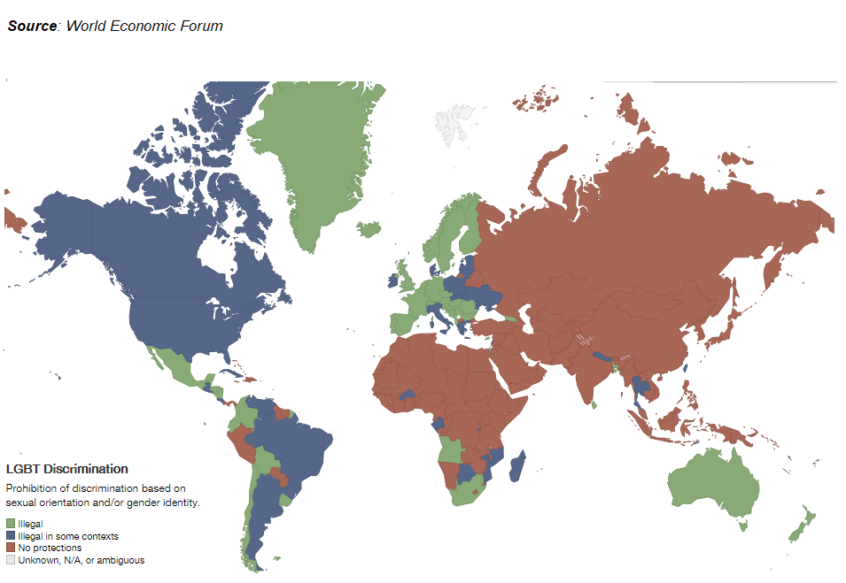

<style> body {text-align: justify} </style> <!-- Justify text. -->

# Instructions

For this assignment you need to complete four exercises and submit your solutions in the form of an HTML or PDF document. Provide both your R code and written answers (note: some questions only require a written answer). You are welcome to add additional R chunks if needed.

**Please use `set.seed()` command** with seed value of 9999 before running any operation involving random chance (e.g., sampling or k-fold validation) to make your code reproducible. Also, unless otherwise specified, you're welcome to pick the number of iterations, folds, tunning parameters etc. to use, based on your theoretical reasoning behind each statistical operation and the power of the computer you're using (e.g., if it would take you half a day to tune a model with 10,000 combinations of hyperparameters, you're welcome to reduce the number of tested combinations). If you have any questions, post them on forum on Canvas or message either your TA or the lecturer.

Points will be awarded based on the following criteria: (i) your code's accuracy, (ii) the quality of your code's annotations and answers, (iii) well-designed figures, and (iv) properly formatted tables. You're welcome to use your preferred packages and functions, as long as they give the correct answers. Please remember to use titles and captions for every table and figure. Label the variables in the relevant tables and make sure you **fully interpret all of the results in your written answers!**

Before starting the assignment, please replace CANDIDATE NUMBER in the file name and in the Rmarkdown header with your own candidate number. You need to "knit" the Rmarkdown file (`.Rmd`) into a `.html` or `.pdf` file by clicking the "knit" button. This will run the entire script from top to bottom in a fresh R session. Make sure that there are no errors in your code. Carefully reading any error messages will help you debugging your code. When you are finished, **zip all the files in your assignment folder** (your Rproject, the `.csv` and other data files, the Rmarkdown file, and the HTML/PDF file you created)

Submit the **zipped folder** on [Inspera](https://oxford.inspera.com/) **before 12pm (noon) on Thursday of Week 0 in Hilary Term 2025 (16th January 2025)**.


\
\

# Exercise 1: Owning a gun in the U.S.

The Cooperative Congressional Election Study surveys Americans during elections. The *cces22.csv* file contains public opinion data on a number of variables that relate to demographics and political attitudes in 2022. For more information about the data see [here](https://dataverse.harvard.edu/dataset.xhtml?persistentId=doi:10.7910/DVN/PR4L8P&version=4.0) 

In this exercise, you are asked to model who owns a gun (yes = themselves or someone in their households vs no = no gun in the household) (variable name is `gun`). 

-	Estimate the appropriate model for this outcome and calculate the predicted probability of owning a gun as a function of age, gender, race, region, and education (codebook is provided below). What is the demographic profile of gun owners in the US? Write a short paragraph discussing this in response to the results from the above model. Feel free to visualize anything you think warrants our attention. 

-	Re-estimate the model predicting gun ownership by also adding variables related to politics like partisanship, trust in government, and whether the respondent was registered to vote (`pid`, `trust_fed_gov`, `register`).

      -	What is the probability of a registered, white male Republican from the North-East to own a gun?
      - How does it compare to a registered white male Democrat from the South?
      

When calculating the probabilities, set the other numerical variables at their medians and categorical variables at their modal values. Make sure you report formatted tables and figures that contain full captions and notes as necessary. 

```{r, warning=FALSE, message=FALSE, echo=FALSE}
require(kable)
require(kableExtra)
require(tidyverse)

# Create a data frame for the variable descriptions
variable_descriptions <- data.frame(
  Variable = c("gun", "age", "female", "register", "white", "pid", "trust_fed_gov", "region", "education"),
  Description = c(
    "Indicates whether the respondent or someone in the household owns a gun.",
    "Respondent's age in years.",
    "Indicates the respondent's gender.",
    "Indicates whether the respondent is registered to vote.",
    "Indicates whether the respondent identifies as White.",
    "Respondent's party identification.",
    "Indicates the respondent's trust in the federal government.",
    "Indicates the respondent's census region.",
    "Respondent's highest level of education."
  ),
  Values = c(
    "0 = No Gun, 1 = Gun",
    "Numeric (years)",
    "0 = Male, 1 = Female",
    "0 = Not Registered, 1 = Registered",
    "0 = Non-White, 1 = White",
    "1 = Democrat, 2 = Republican, 3 = Independent, 4 = Other",
    "1 = A great deal, 2 = A fair amount, 3 = Not very much, 4 = None at all",
    "1 = Northeast, 2 = Midwest, 3 = South, 4 = West",
    "1 = Did not graduate high school, 2 = High school graduate, 3 = Some college, 4 = 2-year degree, 5 = 4-year degree, 6 = Postgraduate degree"
  )
)

# Generate the HTML table
variable_descriptions %>%
  kbl(caption = "Variable Descriptions") %>%
  kable_styling(bootstrap_options = c("striped", "hover", "condensed", "responsive"))

```
\
\

# Exercise 2: Preferences for redistribution across the EU

How much income should governments redistribute to address economic inequality? This question has been the subject of much debate among academics and policymakers since the development of modern welfare states. In this exercise, you will analyze public opinon about the optimal level of **income redistribution**.

You will use data from Round 9 (2018) of the **European Social Survey (ESS)**. The dataset's name is `ess_gb9.csv` and you can find its codebook [here](https://ess-search.nsd.no/en/study/bdc7c350-1029-4cb3-9d5e-53f668b8fa74) and the overview of variables is also provided below. Note that respondents with missing values have already been eliminated. 


| Variable            | Description                                            |
|---------------------|--------------------------------------------------------|
| `red`             | Redistribution preferences recoded (1=low; 5=high) |
| `inc_c`             | Household totla net income recoded (1=low; 10=high) |
| `agea`             | Respondent's age |
| `mbtru`             | Member of trade union |
| `imbgeco`             | Immigration impact on economy model (0 = Bad for economy; 10 = Good for economy) |
| `ctzcntr`             | Is respondent a citizen? (Yes/No) |
| `gndr`             | Male/Female |
| `iphlppl`             | Altruism (1=low; 6=high) |
| `hhmb`             | Household size (no. of people) |
| `rlgblg`             | Is respondent religion (Yes/No) |


1. Fit an **ordered logit model** that seeks to explain respondents' redistribution preferences. Use all other variables as predictors. You are welcome to recode them if deemed appropriate. Very briefly justify your choices. Present model results in a table and interpret the results.

2. Plot the **expected probability** of each redistribution preference response choice across the whole range of possible opinions about the immigrants' impact on the economy (`imbgeco` variable). Other predictors should be kept at their median (if continuous) or modal (if categorical) values.

3. Explain what is the **proportional odds assumption** behind ordered logit regression model. Test for it in the case of the model you fitted above. Based on your results, can the use of ordered logit be justified in this case?


\
\

# Exercise 3: International trade and protests in Russia

In their [2022 paper](https://academic.oup.com/isq/article/64/4/939/5917440), Tabea Palmtag and co-authors modelled the role of international trade in sparking social unrest, using Russia as a case study. 

The dataset you will use for the analyses is `protests.dta`. Recall that you can import .dta files (Stata data) into R for instance using the `read_dta()` function from the [**haven**](https://haven.tidyverse.org/) package. The meaning of the variables is provided in the codebook below. Note that when variables occur in both nominal and (natural) logarithm versions, the logs are taken with adding 1 to the original variable (a common practice to avoid errors when trying to take a log of a zero)

| Variable            | Description                                            |
|---------------------|--------------------------------------------------------|
| `dname`             | District name                                          |
| `rname`             | Region name                                            |
| `year`              | Year                                                   |
| `protest_ikd`       |  Number of protests (based on the data from the Institute of Collective Action IKD) [**outcome**]                                                   |
| `tradeopen`         |  Imports + Exports (% of GDP) [**key predictor**]                           |
| `seceduc`           | % of people with secondary education (exclusive of other education levels) |
| `tereduc`           | % of people with tertiary education (exclusive of other education levels)  |
| `reg_area`          | Surface area (000s square kilometers)                  |
| `lndistmos`         | Distance to Moscow (log kilometers)                    |
| `lnroadden`         | Distance to Moscow (log kilometers/square kilometer)   |
| `pctRussian`        | % share of ethnic Russians                             |
| `reg_avwage`        | Average wage                                           |
| `reg_levelofunempl` | Unemployment                                           |
| `ref_pop`           | Population (millions)                                  |
| `reg_urbanshare`    | Urbanization rate                                      |
| `reg_lifeexp`       | Life expectancy                                        |
| `grp`               | Gross Regional Product (million USD)                  |
| `reg_grpgr`         | Gross Regional Product (annual growth)                 |
| `reg_cpi`           | Regional CPI (consumer price index)                    |
| `EMPL`              | Employment level (000s of people)                      |


Based on the above, complete the exercises that follow. Remember to fully interpret all results and clearly label any tables and figures that you include in the final output. 


1. Below you will choose to run either **Poisson or a negative binomial** regression model. For start, explain the difference between Poisson and negative binomial regression as well as the difference between both models and OLS regression. Why may it be a good idea to run a Poisson/negative binomial regression instead of an OLS regression in this exercise?


2. Run count model, regressing the annual number of protest events in Russia on the trade openness. The unit of observation should be individual Russian regions (identified by `rname` variable). Use data from 2000-2014 period (inclusive). Justify model selection. Present and interpret the results as you would do in a published work.


3. Now consider whether trade openness might have differential impact on protests, depending on regional educational attainment (as found by Palmtag et al. 2022). Run three models, interacting trade openness with i) `seceduc`; ii) `tereduc`; iii) both previous variables summed up. Present and interpret the results as you would do in a published work. **Note**: *If you believe a different specification of the model would work better in uncovering the mediating role of regional educational attainment in trade-protest relationship, you can explain and fit that specification instead.* 


4. Which other controls would you add to complete the model? Fit your preferred specification. Justify your choices, based on theoretical or empirical grounds (or both). Present and interpret the results as you would do in a published work. 


# Exercise 4: LGBTI acceptance across Africa

In this exercise we will be looking at the **determinants of attitudes towards LGBTI people in Africa**. As Figure 4.1. below shows, majority of African countries provide little to no legal protection against LGBTI discrimination. 

\
```{r echo=FALSE, out.width="90%", fig.align='center', fig.topcaption=TRUE,  fig.cap="LGBT Discrimination Situation Around the World"}
### Read the map of LGBT discrimination around the world

```

What about the related social attitudes in those countries? To explore this question, we will use data from Round 7 of the [**Afrobarometer**](https://www.afrobarometer.org/data/merged-data/) survey (`afrobaromater.csv`). The file contains merged survey results from across 34 African countries and variables measuring a diverse set of socio-economic variables. We want to focus on explaining the attitudes towards LGBTI population, which we will proxy by variable `Q87C`. It measures responses to the following question: *"For each of the following types of people, please tell me whether you would like having people from this group as neighbors, dislike it, or not care:  ***Homosexuals***."* The responses were recorded on 1-5 Likert scale going from '1' - 'strongly dislike' to '5' - 'strongly like', with the middle option being '3' - 'would not care'. The raw dataset contains over 300 variables, but for the purpose of this exercise it has been truncated and cleaned. Still, it has multiple variables, which could be plausibly linked to attitudes towards LGBTI people. The variables present in the dataset are listed and briefly described below, with full explanation available in the codebook (`Afrobaromater (codebook).pdf`) included in the exercise folder.

\

<details>
  <summary>**CLICK here to open variables list**</summary>
- `Q86A`: attitudes towards having **homosexuals** as neighbours (1 - strongly dislike, 5 - strongly like)

- `REGION`: name of one of the five **regions of Africa** where a respondent lives
- `URBRUR_COND`: 1 if a respondent lives in urban area, 0 if in rural area
- `AGE_COND`: age group of a respondent
- `EDUC_COND`: education category of a respondent
- `RELIG_COND`: religion of a respondents (1 - Christian, 2 - Muslim, 3 - Other)
- `LivedPoverty`: Lived Poverty Index - average of 5 poverty items, where 0 is the least poor and 4 the most

- `EA_SVC_A`: 0-1 dummy - primary sampling unit/enumeration area has **electricity grid** that most houses could access
- `EA_SVC_B`: 0-1 dummy - primary sampling unit/enumeration area has **piped water** that most houses could access
- `EA_SVC_C`: 0-1 dummy - primary sampling unit/enumeration area has **sewage system** that most houses could access
- `EA_SVC_D`: 0-1 dummy - primary sampling unit/enumeration area has **cell phone service** that most houses could access
- `EA_FAC_A`: 0-1 dummy - primary sampling unit/enumeration area has **post office** present or within walking distance
- `EA_FAC_B`: 0-1 dummy - primary sampling unit/enumeration area has **school** present or within walking distance
- `EA_FAC_C`: 0-1 dummy - primary sampling unit/enumeration area has **police station** present or within walking distance
- `EA_FAC_D`: 0-1 dummy - primary sampling unit/enumeration area has **health clinic** present or within walking distance
- `EA_FAC_E`: 0-1 dummy - primary sampling unit/enumeration area has **market stalls** present or within walking distance
- `EA_FAC_F`: 0-1 dummy - primary sampling unit/enumeration area has **bank** present or within walking distance
- `EA_FAC_G`: 0-1 dummy - primary sampling unit/enumeration area has **paid transport** present or within walking distance
- `EA_SEC_A`: 0-1 dummy - **police** observed in the primary sampling unit/enumeration area
- `EA_SEC_B`: 0-1 dummy - **soldiers** observed in the primary sampling unit/enumeration area
- `EA_SEC_C`: 0-1 dummy - **roadblocks of police/army** observed in the primary sampling unit/enumeration area
- `EA_SEC_D`: 0-1 dummy - **custom checkpoints** observed in the primary sampling unit/enumeration area
- `EA_SEC_E`: 0-1 dummy - **roadblocks of private security/local community** observed in the primary sampling unit/enumeration area

</details> 


\

1. To find out which of the variables best predicts the attitudes towards LGBTI neighbours, you are asked to fit **LASSO regression model**, using `Q87C` as the outcome variable and all the remaining variables as predictors (you can include `REGION` variable as a set of dummies). Train and tune to model paramenters to minimize the RMSE using 5-fold validation (please keep the same folds throughout the exercise)


2. Fit the final model and use it to produce and intepret **variable importance plot**. 

3. One alternative modelling approach to the question at hand would be to use a **regression tree**. Fit a regression tree using the same model formula as above. Try prunning the tree to obtain the best fitting model according to RMSE value

4. Plot variable importance of your final regression tree and briefly **compare** it to the variable importance plot produced based on the LASSO model above. **Note**: *that plotting of the regression tree itself is not necessary if the optimal tree results in too many nodes for a legible plot.*

5. Regression trees have certain limitations. **Explain** briefly what those are and how random forest models attempt to overcome them. 

6. Fit a **random forest** using the same model formula as above. Select the optimal model according to RMSE and compare the resulting fit against the LASSO and regression tree models produced above. Based on that, which modelling technique, if any, would you choose to model the social attitudes towards LGBTI neighbors across Africa and why?


\
\

# Session Info (for Reproduction)

This analysis was produced using the following environment:

```{r}
sessionInfo()
```

